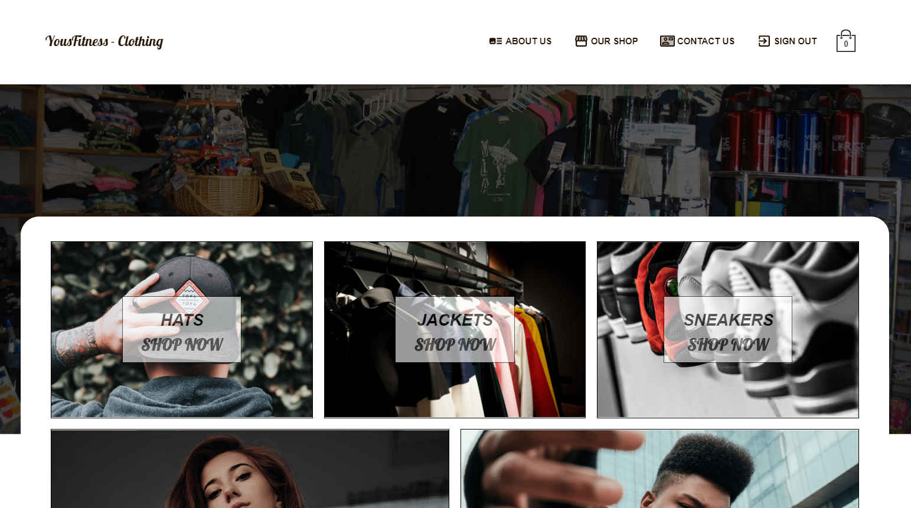
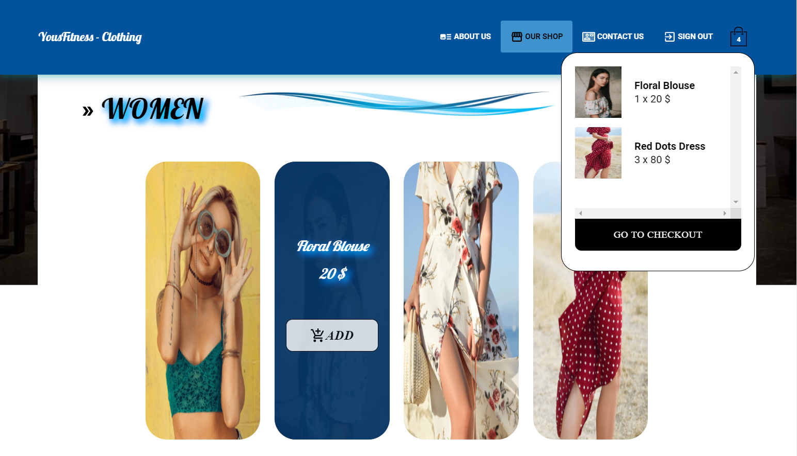
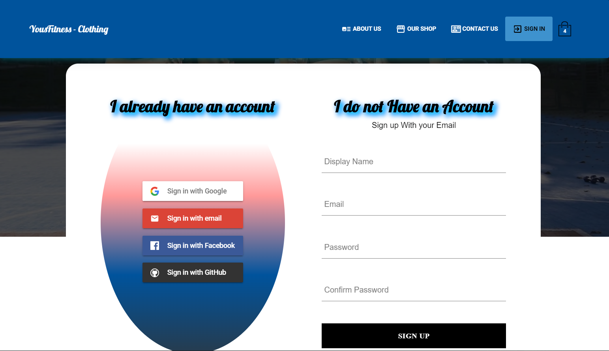
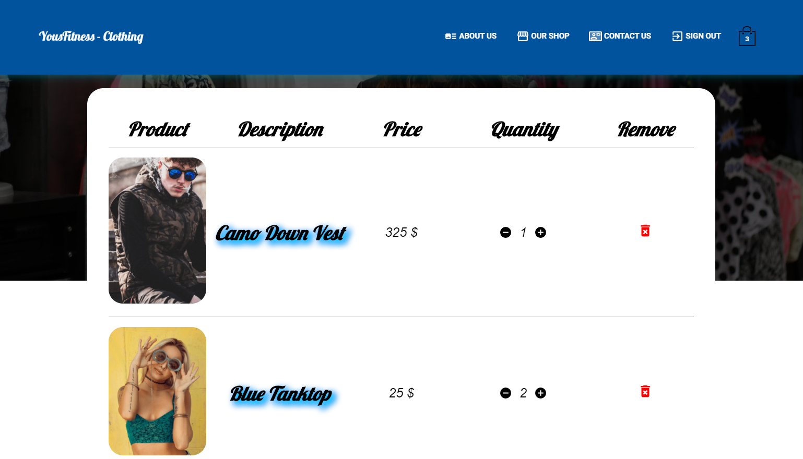

## Welcome To YH Clothing :

This is a E-com Store Responsive Web App created mainly with React.JS from scratch.
The App is Live on [TheYousfi.com/YH-Clothing](http://www.theyousfi.com/YH-Clothing/) <=

## Overview :

## Features :

These are some of the features :

* Responsive Web App using some Material UI Components.

* State Management Using Redux + Hooks ( Apollo GraphQL in the next Release )

* Authentication Using Email-Passord or simply with the Google/Facebook/Github Accounts

* Payement Processing Using Stripe ( Paypal in the next Release )

* Performance Enhancement Using Suspense to get multiple chanks of our code ( Next.Js for SSR in the next Release )

* Lazy Loading Images 

